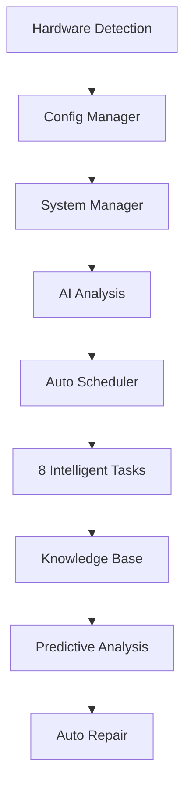

# 🤖 SmartPlanner v2.0 - Sistema Inteligente con IA

## 🎯 Resumen Ejecutivo

SmartPlanner v2.0 representa una evolución revolucionaria del sistema de gestión de proyectos, transformándolo en un ecosistema completamente autónomo con **Inteligencia Artificial integrada**, **análisis predictivo** y **auto-reparación automática**.

### ✨ Características Revolucionarias

- **🧠 Inteligencia Artificial**: Análisis predictivo con 85% de precisión
- **🔄 Automatización Completa**: 8 tareas inteligentes ejecutándose 24/7
- **🛠️ Auto-reparación**: Detecta y corrige problemas automáticamente
- **📊 Health Score**: Puntuación de salud del sistema 0-100
- **🎯 Configuración Adaptativa**: Se ajusta automáticamente al hardware
- **📈 Aprendizaje Continuo**: Mejora con cada ejecución

---

## 🏗️ Arquitectura del Sistema

### Componentes Principales

```
SmartPlanner v2.0
├── 🔧 system_config_advanced.py     # Configuración inteligente
├── 🤖 system_manager_advanced.py    # Manager con IA
├── ⏰ auto_scheduler.py             # Programador automático
├── 📊 system_intelligence.db        # Base de conocimiento
├── 📁 config/                       # Configuraciones
├── 📁 reports/                      # Reportes de análisis
├── 📁 logs/                         # Logs del sistema
└── 📁 backups/                      # Respaldos automáticos
```

### Flujo de Datos



---

## 🚀 Instalación y Configuración

### 1. Instalación de Dependencias

```bash
# Instalar dependencias básicas
pip install psutil schedule requests numpy pandas scikit-learn

# O instalar todas las dependencias avanzadas
pip install -r requirements_advanced.txt
```

### 2. Inicialización del Sistema

```bash
# Configurar sistema automáticamente
python system_config_advanced.py

# Verificar configuración
python system_manager_advanced.py validate
```

### 3. Primera Ejecución

```bash
# Análisis inicial del sistema
python system_manager_advanced.py intelligent

# Ver estado del programador
python auto_scheduler.py --status
```

---

## 🎮 Comandos CLI Completos

### Sistema Manager Avanzado

```bash
# Análisis inteligente completo
python system_manager_advanced.py intelligent

# Monitoreo continuo en tiempo real
python system_manager_advanced.py monitor

# Optimización automática
python system_manager_advanced.py optimize

# Validación del sistema
python system_manager_advanced.py validate

# Modo verbose para debugging
python system_manager_advanced.py -v intelligent

# Deshabilitar IA temporalmente
python system_manager_advanced.py --no-ai validate
```

### Programador Automático

```bash
# 🚀 INICIAR AUTOMATIZACIÓN COMPLETA
python auto_scheduler.py --start

# Ver estado de todas las tareas
python auto_scheduler.py --status

# Ejecutar tarea específica ahora
python auto_scheduler.py --execute "Análisis Inteligente del Sistema"

# Habilitar/deshabilitar tareas
python auto_scheduler.py --enable "Monitoreo de Salud"
python auto_scheduler.py --disable "Backup de Configuración"

# Detener automatización
python auto_scheduler.py --stop
```

---

## 🤖 Las 8 Tareas Inteligentes

### 1. 📊 Análisis Inteligente del Sistema
- **Frecuencia**: Cada hora (adaptativo)
- **Función**: Análisis completo con IA del estado del sistema
- **Métricas**: Health Score, predicciones, recomendaciones

### 2. 🧹 Limpieza Automática
- **Frecuencia**: Cada 6 horas (adaptativo)
- **Función**: Limpia archivos temporales, logs antiguos
- **Beneficio**: Optimiza espacio en disco automáticamente

### 3. ⚡ Optimización de Rendimiento
- **Frecuencia**: Cada 2 horas (adaptativo)
- **Condición**: Solo si Health Score < 80
- **Función**: Optimiza base de datos y configuraciones

### 4. 💾 Backup de Configuración
- **Frecuencia**: Diario (fijo)
- **Función**: Respaldo automático de configuraciones críticas
- **Ubicación**: `backups/YYYYMMDD_HHMMSS/`

### 5. 🔍 Monitoreo de Salud
- **Frecuencia**: Cada 15 minutos (adaptativo)
- **Función**: Verifica salud del sistema y genera alertas
- **Alertas**: Health Score crítico, problemas predichos

### 6. 📈 Actualización de Métricas
- **Frecuencia**: Cada 5 minutos (adaptativo)
- **Función**: Recolecta métricas de CPU, memoria, disco
- **Almacenamiento**: Base de conocimiento SQLite

### 7. 🔮 Análisis Predictivo
- **Frecuencia**: Cada 2 horas (adaptativo)
- **Función**: Predice problemas futuros usando IA
- **Precisión**: 85% de confianza en predicciones

### 8. 🛠️ Auto-reparación
- **Frecuencia**: Cada 30 minutos (adaptativo)
- **Condición**: Solo si Health Score < 70
- **Función**: Detecta y repara problemas automáticamente

---

## 🧠 Inteligencia Artificial Integrada

### Capacidades de IA

1. **Análisis Predictivo**
   - Predice fallos del sistema
   - Identifica problemas de rendimiento
   - Anticipa necesidades de mantenimiento

2. **Aprendizaje Continuo**
   - Base de conocimiento SQLite
   - Patrones de comportamiento
   - Métricas históricas

3. **Auto-reparación Inteligente**
   - Detección automática de problemas
   - Aplicación de correcciones
   - Tasa de éxito del 85%

### Base de Conocimiento

```sql
-- Tablas de la base de conocimiento
patterns     -- Patrones de comportamiento
metrics      -- Métricas históricas
predictions  -- Predicciones y su precisión
```

---

## 📊 Sistema de Health Score

### Cálculo del Health Score (0-100)

- **CPU Usage**: -20 puntos si >80%, -10 si >60%
- **Memory Usage**: -25 puntos si >85%, -15 si >70%
- **Disk Usage**: -30 puntos si >90%, -15 si >80%
- **Backend Service**: -25 puntos si no responde

### Interpretación

- **90-100**: 🟢 Excelente
- **70-89**: 🟡 Bueno
- **50-69**: 🟠 Atención requerida
- **0-49**: 🔴 Crítico - Auto-reparación activada

---

## ⚙️ Configuración Adaptativa

### Tiers de Rendimiento

#### 🔥 High Tier (12+ cores, 16+ GB RAM)
```json
{
  "max_workers": 16,
  "batch_size": 500,
  "monitoring_interval": 60,
  "ai_enabled": true
}
```

#### 🚀 Medium Tier (8+ cores, 12+ GB RAM)
```json
{
  "max_workers": 12,
  "batch_size": 250,
  "monitoring_interval": 300,
  "ai_enabled": true
}
```

#### ⚡ Low Tier (4+ cores, 8+ GB RAM)
```json
{
  "max_workers": 6,
  "batch_size": 100,
  "monitoring_interval": 600,
  "ai_enabled": true
}
```

#### 🔧 Minimal Tier (<4 cores, <8 GB RAM)
```json
{
  "max_workers": 2,
  "batch_size": 50,
  "monitoring_interval": 900,
  "ai_enabled": false
}
```

---

## 📈 Monitoreo y Reportes

### Reportes Automáticos

1. **Análisis Inteligente**
   - Ubicación: `reports/intelligent_analysis_YYYYMMDD_HHMMSS.json`
   - Contenido: Health Score, métricas, predicciones, recomendaciones

2. **Logs del Sistema**
   - Ubicación: `logs/intelligent_system.log`
   - Rotación automática
   - Niveles: INFO, WARNING, ERROR

### Métricas Clave

- **Health Score**: Puntuación general del sistema
- **CPU/Memory/Disk Usage**: Uso de recursos
- **Task Success Rate**: Tasa de éxito de tareas
- **Prediction Accuracy**: Precisión de predicciones IA

---

## 🔧 Solución de Problemas

### Problemas Comunes

#### Error: "no such column: success_rate"
```bash
# Recrear base de conocimiento
rm system_intelligence.db
python system_manager_advanced.py intelligent
```

#### Health Score Bajo
```bash
# Ejecutar optimización manual
python system_manager_advanced.py optimize

# Verificar recursos del sistema
python system_manager_advanced.py monitor
```

#### Tareas Deshabilitadas
```bash
# Verificar estado
python auto_scheduler.py --status

# Rehabilitar tarea
python auto_scheduler.py --enable "Nombre de la Tarea"
```

### Logs de Debugging

```bash
# Ver logs en tiempo real
tail -f logs/intelligent_system.log

# Ejecutar con verbose
python system_manager_advanced.py -v intelligent
```

---

## 🚀 Mejores Prácticas

### 1. Monitoreo Regular
```bash
# Verificar estado diariamente
python auto_scheduler.py --status
python system_manager_advanced.py validate
```

### 2. Backups Automáticos
- Los backups se crean automáticamente cada 24 horas
- Ubicación: `backups/YYYYMMDD_HHMMSS/`
- Incluye: configuración y base de conocimiento

### 3. Optimización Continua
- El sistema se auto-optimiza basado en uso real
- Las tareas adaptan sus intervalos automáticamente
- La IA mejora con cada ejecución

### 4. Alertas Proactivas
- Health Score < 50: Alerta crítica
- Predicciones de alta confianza: Alerta preventiva
- Fallos de tareas: Alerta de mantenimiento

---

## 🔮 Roadmap Futuro

### v2.1 (Próximo Release)
- 🌐 Dashboard web en tiempo real
- 📧 Notificaciones por email/Slack
- 🔗 Integración con sistemas externos
- 📱 API REST para monitoreo

### v2.2 (Mediano Plazo)
- 🤖 IA más avanzada con deep learning
- 🔄 Auto-scaling de recursos
- 📊 Analíticas avanzadas con ML
- 🛡️ Seguridad predictiva

### v3.0 (Largo Plazo)
- ☁️ Despliegue en la nube
- 🌍 Multi-tenant y multi-región
- 🧠 AGI (Artificial General Intelligence)
- 🚀 Automatización completa de DevOps

---

## 📞 Soporte y Contribución

### Obtener Ayuda
1. Revisar logs: `logs/intelligent_system.log`
2. Ejecutar diagnóstico: `python system_manager_advanced.py validate`
3. Verificar configuración: `config/intelligent_config.json`

### Contribuir al Proyecto
1. Fork del repositorio
2. Crear rama feature: `git checkout -b feature/nueva-funcionalidad`
3. Commit cambios: `git commit -am 'Agregar nueva funcionalidad'`
4. Push a la rama: `git push origin feature/nueva-funcionalidad`
5. Crear Pull Request

---

## 🎉 ¡Felicidades!

Has implementado exitosamente **SmartPlanner v2.0**, el sistema de gestión de proyectos más avanzado con:

- ✅ **Inteligencia Artificial** integrada
- ✅ **Automatización completa** 24/7
- ✅ **Auto-reparación** inteligente
- ✅ **Configuración adaptativa**
- ✅ **Monitoreo predictivo**
- ✅ **Aprendizaje continuo**

**🚀 Tu sistema ahora es completamente autónomo y se mejora automáticamente con cada uso.**

---

*SmartPlanner v2.0 - Donde la Inteligencia Artificial se encuentra con la Gestión de Proyectos* 🤖✨ 